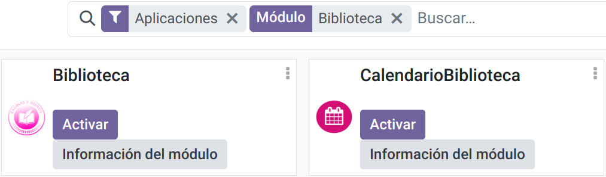

# Manual de usuario
## Instalación de módulos
A lo largo de esta sección, se plantean dos formas de agregar a la base de datos *Biblioteca*[^1] los módulos que contiene este contenedor de Github. 

1. Si ha seguido el consejo del primer paráfo y la ha nombrado como nosotros, mediante la ejecución por terminal del archivo [Odoo.sh](Odoo.sh), `bash Odoo.sh` sería la forma más directa. 
2. A partir de comando `odoo --addons-path=. -d NombreDeTuBaseDeDatos -u moduleOdoo --dev xml` en donde debe sustituir *NombreDeTuBaseDeDatos* por el nombre que le ha dado a su base de datos al configurar Odoo[^2].  

## Acceso al servicio
A continuación, ingrese a http://localhost:8069/ para llegar a la página principal de odoo; no se asuste si le solicita que ingrese con su usuario y contraseña de la base de datos la primera vez que entre. En la barra superior hay un icono en la esquina superior derecha con forma de nueve cuadrados juntos nombrado ***Home Menu*** (). Al pulsarlo se desplegará un menú de opciones.  

***Aplicaciones*** será su destino, dónde le redirigirá a la pesataña indicada para encontrar todos los módulos de Odoo. Con ayuda de la Barra de Búsqueda podrá localizar más facilmente las aplicaciones, llamadas ***Biblioteca*** y ***CalendarioBiblioteca***. Active ambas.

<figure>
    
    <figcaption>Una visualización previa del aspectos de los dos módulos de Odoo que debe activarse.</figcaption>
</figure>

Para ingresar vuelva a desplegar el menú. Ahora aparecerán otras dos opciones más, que corresponden a los módulos que acaba de activar, con los nombres ***Biblioteca*** y ***Calendario***.

## Primeros pasos
Comenzaremos con el módulo ***Biblioteca***. Nada más entrar, será recibido con una vista de una lista vacía; aquí aparecerá la información preliminar de los libros según los vaya agregando. Para añadir un ejemplar a la base de datos, presione el botón **Nuevo** y se abrirá un formulario con la información básica.

<figure>
    
    <figcaption>Una visualización previa del aspectos del formulario de información de un libro.</figcaption>
</figure>

En la segunda página de la parte inferior, llamada **Prestámos**, podrá añadir una línea a la cuál adjuntará un miembro de los que existen en la base de datos, el tiempo estándar que estará válido el préstamo, las fecha de comienzo de dicho préstamo y el estado del préstamo; esto último se controla con los botones Prestamo, Devolución y Renovación. Si un libro no está renovado, no se podrá modificar el campo de Días extras.

<figure>
    
    <figcaption>Una visualización previa del aspectos de los prestámos de un libro.</figcaption>
</figure>

## Activar miembros a la biblioteca
Cabe mencionar que si un usuario no tiene activo su carné de biblioteca, el sistema no permitirá que se realice el préstamo. Para acredentar digitalmente dicho carné, deberá dirigirse a ***Ajustes*** en el menú desplegable, después a **Usuarios y compañías** en el encabezado del sitio web y entrar en el usuario o crear uno nuevo, en el caso de que no esté registrado. Dentro del fórmulario habrá un radio button el cual deberá marcar para activarlo.

<figure>
    
    <figcaption>Una visualización previa del aspectos de la nueva interfaz de los usuarios de Odoo, ya marcado.</figcaption>
</figure>

Al igual que en la vista de libros, aquí también podrá conocer que libros han sido sacados de la biblioteca por cada usuario a través de la pestaña **Préstamos**.

> Nota: Tener cuidado con no confundir con la pestaña **Ajustes** situada entre **Catálogo** y **Registros**. Esa almacena propiedades de los libros como el idioma o la categoría.

# Calendario de devoluciones
En esta otra aplicación, automatizada a partir de las decisiones tomadas en ***Biblioteca***, se llevará un registro del día en que se deberá devolver un libro como plazo máximo una vez prestado[^3]. Esto es para una mejor visibilidad y monitoreo por parte del bibliotecario.

<figure>
    
    <figcaption>Una visualización previa del aspectos de la nueva interfaz de los usuarios de Odoo, ya marcado.</figcaption>
</figure>

[^1]: No es índole de este escrito enseñar a crear una base de datos para Odoo. Si el usuario no sabe cómo hacerlo, le recomendamos que siga los siguientes pasos de la página oficial de [Odoo](https://www.odoo.com/documentation/17.0/es/administration/on_premise/source.html).
[^2]: En caso de que no lo recuerde, puede gestionar todas sus bases de datos de Odoo desde este [enlace](http://localhost:8069/web/database/manager) habiéndo lanzado el servidor previamente con el comando `odoo` desde su terminal.
[^3]: Actualmente está funcionalidad está en fase de desarrollo, mostrando únicamente la fecha impuesta por el botón Prestamo, pero sin poder modificándola, ya sea ampliándola con una renovación ni reduciéndola con una devolución temprana.
